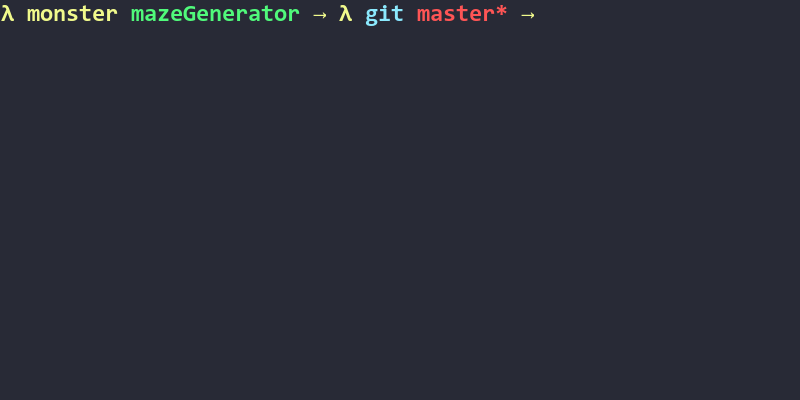

# mazeGenerator

mazeGenerator uses ncurses library to render characters on terminal screen and uses Recursive Backtracker algorithm to generate a random maze. It demonstrates each step, so you can watch and see how it generates a maze!

### Changing the Grid Size

You can change the size of the maze by changing width and height values in config.ini file. You can also change the speed of the rendering by the changing delay value.

### Installing Dependency to Compile this project

If you want to compile this project, you should first install ncurses library by using this command:  

### Ubuntu  

`sudo apt-get install libncurses5-dev libncursesw5-dev` 

### Arch Linux  

`sudo pacman -S ncurses`

### Compiling

`make` or `make build`

### Running

To run the mazeGenerator :  
`./mazeGenerator`

##### HAVE FUN!
